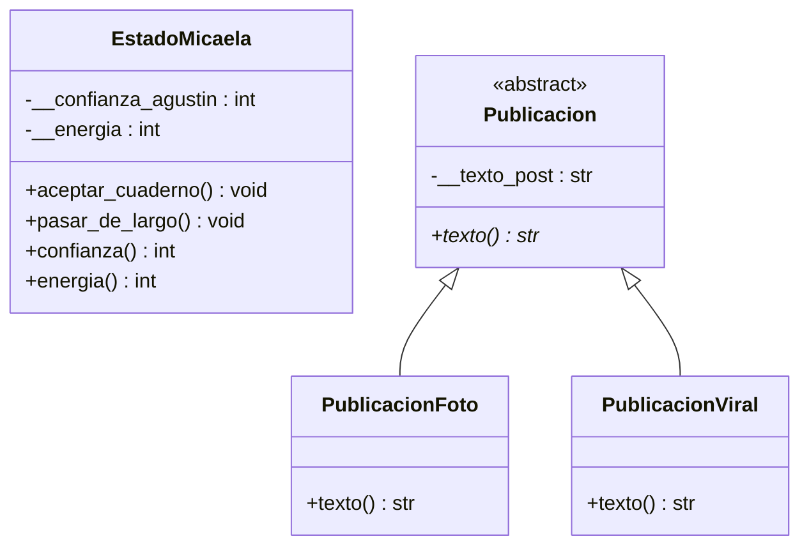

# el UML

```mermaid
classDiagram
    class EstadoMicaela {
        -__confianza_agustin : int
        -__energia : int
        +aceptar_cuaderno() void
        +pasar_de_largo() void
        +confianza() int
        +energia() int
    }

    class Publicacion {
        <<abstract>>
        -__texto_post : str
        +texto()* str
    }

    class PublicacionFoto {
        +texto() str
    }

    class PublicacionViral {
        +texto() str
    }

    Publicacion <|-- PublicacionFoto
    Publicacion <|-- PublicacionViral
```
